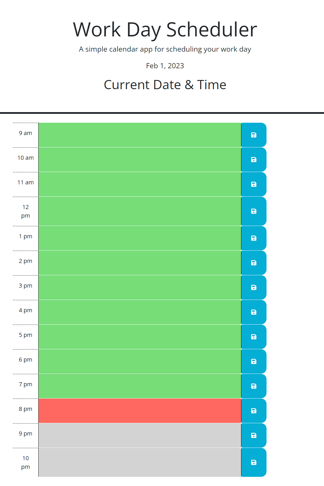

# Dynamic Calendar  

### <u> Description: </u>
This is a calendar that shows current time between business hours (9am-5-pm). Current time is highlighted in red, past in grey, and future in green.

### <u> Notes: </u>
- This is a calendar that shows current time between business hours (9am-5-pm). Current time is highlighted in red, past in grey, and future in green. 
- For this Challenge time slots are extended to better demonstrate functionality (9am-10pm current time will be highlighted in red)

### <u> Screenshot: </u>

  

    
### <u> Deployable Link to Website: </u>

https://myagentortega.github.io/randomizer-tool/
### <u> Support:  </u>

- [MDN](https://developer.mozilla.org/en-US/)  

- [Google](https://Google.com)

### <u> Contact: </u>

- [Contact - Future Coder - Joseph S. Ortega](mailto:MyAgentOrtega@gmail.com)

### <u> Acknowledgement </u>

Authors and acknowledgement: Thank you to all my peers, tutors and instructors that helped me along the way!

### <u> License </u>

